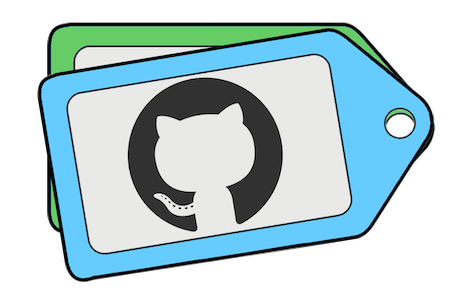

 <p align="center"> 
    
 </p>

# tag-ur-it

A GitHub Action to automatically tag issues with labels and assignees based on a rules yml file in the repo

## Development

```sh
# Install dependencies
npm install

# Run typescript
npm run build
```

## Example Usage

First, set up an `issue_template.md` that encourages users to enter required information for our tool. See how this is done at [Microsoft](https://github.com/microsoft/azure-pipelines-tasks/blob/master/issue_template.md).

For our example, we will use the following:

```
## Required Information

Entering this information will route you directly to the right team and expedite traction.

**Question, Bug, or Feature?**  
*Type*: here

Should this get assigned to @damccorm?
**Assign to damccorm**: replace this with yes or no

## Issue Description

Describe your issue here
```

Next, set up a .yml file `issue-rules.yml` with rules in your repository. These rules should correspond to your issue template. See an example of how [Microsoft does this](https://github.com/microsoft/azure-pipelines-tasks/blob/master/issue-rules.yml).

The basic formatting of this yml file should be as follows:

```
# list of primary rules
rules:
- valueFor: '*Type*' # If user specifies "*Type*: Question" above, it will get labeled with "question" and "plz help"
  contains: Question
  addLabels: ['question', 'plz help']
- valueFor: '*Type*'
  contains: Bug
  addLabels: ['bug']
- valueFor: '*Type*'
  contains: Feature
  addLabels: ['enhancement']
- valueFor: '**Assign to damccorm**' # If user specifies "**Assign to damccorm**: yes", it will get labeled with "damccorms problem now" and assigned to "@damccorm"
  contains: yes
  addLabels: ['damccorms problem now']
  assign: ['damccorm']

# List of secondary rules to run if no matches detected in primary rules
nomatches:
- contains: 'this should get assigned to damccorm' # Checks the entire issue for a substring match. If one is found, adds labels "damccorms problem now" and "maybe?", and assigns to "@damccorm"
  addLabels: ['damccorms problem now', 'maybe?']
  assign: ['damccorm']

# List that always runs after rules and nomatches. Look for missing sets of tags here.
tags:
- noneIn: ['bug', 'enhancement', 'question'] # If no bug, enhancement, or question labels are added, label with 'triage'
  addLabels: ['triage']
```

Finally, setup your action workflow to run this action. Try out our routing (using this example) by opening up an issue in this repo!

```
- uses: actions/checkout@v1
- uses: damccorm/tag-ur-it@master
with:
   repo-token: "${{ secrets.GITHUB_TOKEN }}"
   configuration-path: "path/to/issue-rules.yml"
```

## Contributing

If you have suggestions for how tag-ur-it could be improved, or want to report a bug, open an issue! We'd love all and any contributions.

For more, check out the [Contributing Guide](CONTRIBUTING.md).

## Credit

Based off of https://github.com/zachariahcox/tag-ur-it (with permission)